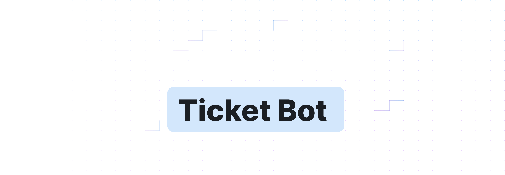

<div align="center">

<a href="https://noahprm.tech" style="display: block; text-align: center;">
  
  <h1 align="center">Ticket Bot</h1>
</a>

</div>
<p align="center">
  Gestion des tickets simple, facile à utiliser & rapide à configurer.
</p>

<p align="center">
  <a href="https://noahprm.tech"><strong>NoahPrm</strong></a> ·
    <a href="https://discord.gg/A5NDrh6Wxb"><strong>Discord</strong></a> ·
    <a href="https://fluxbot.eu"><strong>FluxBot</strong></a> ·
    <a href="https://github.com/noahprm/ticket-bot"><strong>Main Repository</strong></a> ·
    <a href="https://github.com/NoahPrm/ticket-bot/blob/main/LICENSE"><strong>License</strong></a> ·
    <a href="https://github.com/NoahPrm/ticket-bot/releases/tag/latest"><strong>Last Release</strong></a> 
</p>
<br/>
</div>

# Installation
1. Téléchargez le code source du bot [disponible ici](https://github.com/NoahPrm/ticket-bot/releases/latest).
2. Installez les dépendances avec la commande `npm install`.
3. Configurez le bot dans le fichier `config.js`.
4. Lancez le bot avec la commande `node index.js`, ou `node .`.
5. Invitez le bot sur votre serveur discord.
6. Exectuez la commande `/ticket-setup` pour configurer le message de création de ticket.

Et voilà, votre bot est prêt à être utilisé !

# Commandes
- `/ticket-setup` : Configure le message de création de ticket.

# Support & Aide
Si vous avez besoin d'aide ou de support, vous pouvez rejoindre mon serveur discord [ici](https://discord.gg/A5NDrh6Wxb).

# Configuration
```js
class config {
    constructor() {
        // Token du bot
        this.token = "TOKEN_BOT"

        // Configuration des tickets
        this.ticket_category = "ID_CATEGORIE_TICKETS"
        this.staff_role = "ID_ROLE_STAFF"

        // Configuration des embeds de base
        this.embed_color = "#808080"
        this.embed_footer = "👀 github.com/noahprm/ticket-bot"
        this.embed_thumbnail = "https://cdn.discordapp.com/avatars/1328471238296735825/2c448755b13c94965a03451e46ffb860.png?size=1024"

        // Configuration des titres des différents embeds de bienvenue pour les différentes catégories des tickets
        this.title_1 = "**Catégorie 1**" 
        this.title_2 = "**Catégorie 2**"
        this.title_3 = "**Catégorie 3**"
        this.title_4 = "**Catégorie 4**"

        // Configuration des description des différents embeds de bienvenue pour les différentes catégories des tickets
        this.description_1 = "<:fleche:1251602525682012230> Voici un example de description pour la catégorie n°1"
        this.description_2 = "<:fleche:1251602525682012230> Voici un example de description pour la catégorie n°2"
        this.description_3 = "<:fleche:1251602525682012230> Voici un example de description pour la catégorie n°3"
        this.description_4 = "<:fleche:1251602525682012230> Voici un example de description pour la catégorie n°4"

        // Configuration des footers des différents embeds de bienvenue pour les différentes catégories des tickets
        this.footer_1 = "👀 github.com/noahprm/ticket-bot"
        this.footer_2 = "👀 github.com/noahprm/ticket-bot"
        this.footer_3 = "👀 github.com/noahprm/ticket-bot"
        this.footer_4 = "👀 github.com/noahprm/ticket-bot"

        // Configuration des couleurs des différents embeds de bienvenue pour les différentes catégories des tickets
        this.color_1 = "#ff4000" 
        this.color_2 = "#ff4000" 
        this.color_3 = "#ff4000" 
        this.color_4 = "#ff4000" 

        // Configuration des différentes parties de l'embed de présentation (celui ou il y aura le select menu)
       this.open_title = "**<:staff:1327406634418442271> Ouvrir un ticket**"
       this.open_description = "<:check_mark:1241457145606836274> Système de tickets avancé développé par noahprm\n\n<:fleche:1251602525682012230> Voici un système de ticket avancé totalement configurable et personnalisable à l'aide de son fichier \"**config.js**\" où vous pourrez totalement modifier les embeds.\n\n<:fleche:1251602525682012230> Vous pouvez obtenir ce système de ticket en téléchargeant le code de ce repo github et en le configurant.\n\n<:fleche:1251602525682012230> Mes services pour des bots persos ne sont pas chères, alors pourquoi ne pas en profiter !"
       this.open_footer = "👀 github.com/noahprm/ticket-bot"
       this.open_color = "#ff4000"
       this.open_thumbnail = "https://cdn.discordapp.com/avatars/1328471238296735825/2c448755b13c94965a03451e46ffb860.png?size=1024"
    }

}

module.exports = new config()
```

# Crédits / Contributions
- [NoahPrm](https://github.com/noahprm) - Développeur du bot
- [discord.js](https://discord.js.org) - Librairie utilisée pour le développement du bot

Vous aussi vous pouvez contribuer à ce projet en créant une pull request ou en ouvrant une issue!

# License
Ce projet est sous license MIT - voir le fichier [LICENSE](https://github.com/NoahPrm/ticket-bot/blob/main/LICENSE) pour plus d'informations.

# Repository Views
